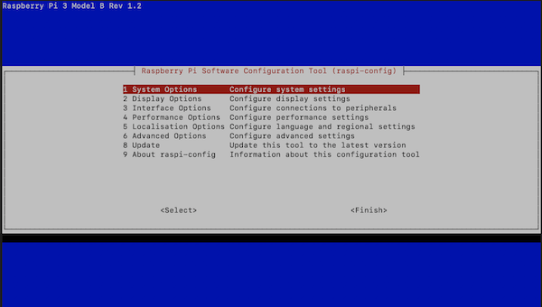
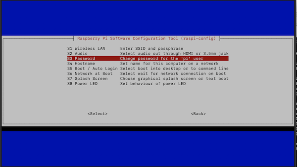
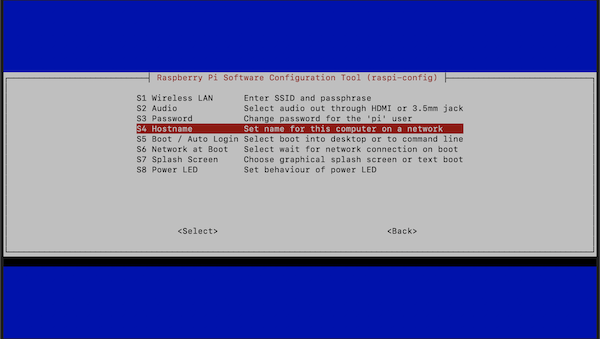
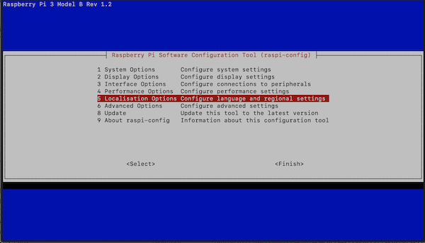
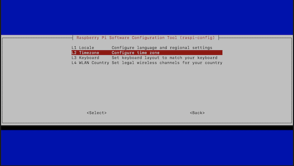
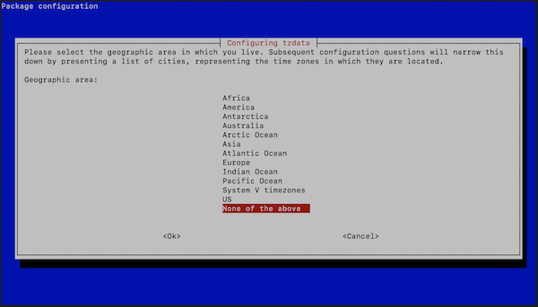
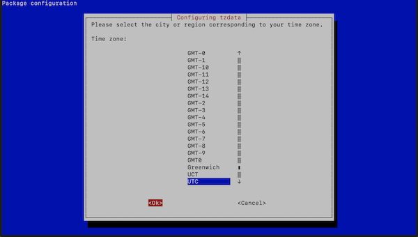
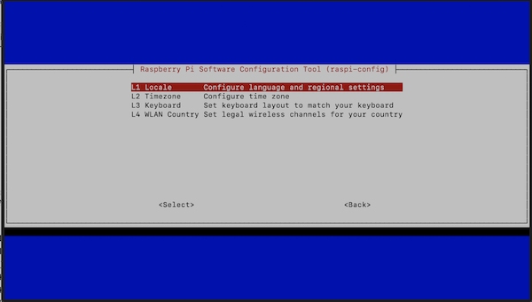
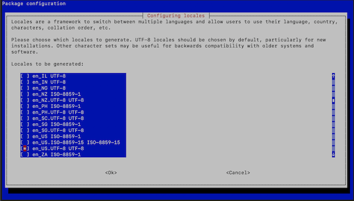
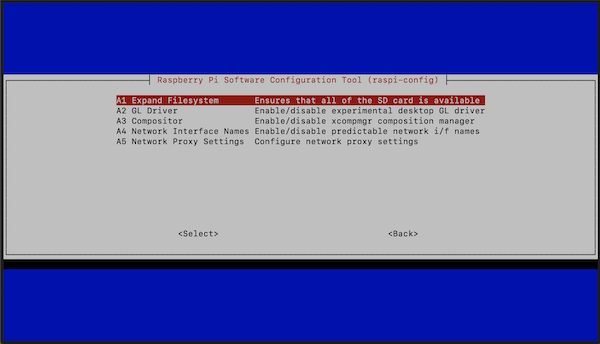

# stratux2tak
Stratux image build to include snstak/stratuxcot and stratux image to feed detected aircraft positions to Team Awareness Devices.

## Summary

This page provides instructions on one known method to configure a [Stratux](https://github.com/cyoung/stratux) (ADS-B) receiver to feed CoT information to a [Team Awareness Kit](https://tak.gov) (TAK) server or other [TAK](https://tak.gov) end-user devices (EUD) to  and stream detected aircraft positions within the device's coverage area, using the [snstac/stratuxcot](https://github.com/snstac/stratuxcot) service.  The configuration described below is intended for a mobile application to observe surrounding aircraft locations and feed ATAK EUDs on a LAN in LTE-denied areas.

> **NOTE:** The following instructions have been confirmed to work with  Raspberry Pi 3B and Pi 4 models.

## Parts List

The following are parts utilized for a successful implementation of Stratux feeds to a TAKServer or other open-sourced cursor-on-target (CoT) relays.  See [http://stratux.me #diy-kits-and-parts](http://stratux.me/#diy-kits-and-parts) for details on alternative parts.

### Required Parts

1. [Raspberry Pi 3B](https://www.amazon.com/gp/product/B01LPLPBS8/ref=ppx_yo_dt_b_asin_title_o02_s00?ie=UTF8&psc=1) (not 3B+).
!!!! I have successfully run the latest images on both a Raspberry Pi 4 and Raspberry Pi Zero 2W.
2. 1090 / 978 Radios:
    - [Stratux 1090ES & UAT - Radios (Low Power UAT) and High Gain Antennas](https://www.amazon.com/gp/product/B07K1GZMM9/ref=ppx_yo_dt_b_asin_title_o07_s01?ie=UTF8&psc=1) RECOMMENDED
    - [Nooelec Dual Band NESDRs](https://www.amazon.com/gp/product/B076GWF6FF/ref=ppx_yo_dt_b_asin_title_o03_s00?ie=UTF8&psc=1) - See [here](http://stratux.me/#diy-kits-and-parts) for alternative SDR's TESTED
    
>    Both 1090 and 978 SDRs are required for Stratux to operate.
{.is-warning}

3. sD Card with Stratux / Raspbian OS flashed onto it.  [Stratux Image](http://stratux.me) is located [here](https://github.com/cyoung/stratux/releases/download/v1.6r1-eu27-us/stratux-v1.6r1-eu027-3d07b461-us.img.zip): 
([https://github.com/cyoung/stratux/releases/download/v1.6r1-eu27-us/stratux-v1.6r1-eu027-3d07b461-us.img.zip](https://github.com/cyoung/stratux/releases/download/v1.6r1-eu27-us/stratux-v1.6r1-eu027-3d07b461-us.img.zip))

### Recommended Part(s):  GPS Receiver

1. Stratux GPYes 2.0 u-blox 8 USB GPS unit: https://www.amazon.com/gp/product/B0716BK5NT/ref=as_li_ss_tl?ie=UTF8&linkCode=sl1&tag=crewdog0c-20&linkId=c2993713e1637ae6eaf4ae904b4322d0)
RECOMMENDED
   > Optional Removable External GPS Antenna:  [Stratux GPYes 2.0 External Antenna](https://www.amazon.com/Stratux-GPYes-2-0-External-Antenna/dp/B07NDPXDDY/ref=as_li_ss_tl?ref_=ast_sto_dp&linkCode=sl1&tag=crewdog0c-20&linkId=4ebb8ef33b9e2ebb92ab2e600f20d798&language=en_US)
1. [VK-162 G-Mouse - Remote Mount USB - External GPS Navigation Dongle - Supports Stratux, Raspberry Pi, Windows, Linux](https://www.amazon.com/gp/product/B01EROIUEW/ref=ppx_yo_dt_b_asin_title_o01_s00?ie=UTF8&psc=1) TESTED

> See [here](http://stratux.me/#diy-kits-and-parts) for other GPS receiver options

### Optional Part(s)

1. [Stratux Case](https://www.amazon.com/gp/product/B072ND582W/ref=ppx_yo_dt_b_asin_title_o01_s00?ie=UTF8&psc=1) (recommended for mobile applications).

---

## sD Card Preparation

### Flash Stratux Image

Using your preferred image flashing application such as Pi Imager, BalenaEtcher, etc., flash the sD card with the latest [Stratux](http://stratux.me) image, which can be downloaded at: 

[https://github.com/cyoung/stratux/releases/tag/v1.6r1-eu27-us](https://github.com/cyoung/stratux/releases/tag/v1.6r1-eu27-us)

> **NOTE:** These instructions are for the specific image above.  Newer image versions may or likely will ***NOT*** work.

## Initial Set-up / Configuration

### Initial Boot

1. Install SDRs into the Raspberry Pi board ***Ensure antennas are connected to the SDRs prior to powering them up.***
2. . Install the sD card into the Raspberry Pi unit
3. Power the Raspberry Pi 3b (NOTE:  ensure adequate voltage supply or you will receive multiple warnings possibly interrupting your initial configuration.

> If you do not have access to an ethernet connection on your network, you may consider connecting a keyboard and monitor to your Raspberry Pi board **PRIOR** to powering up the unit.

### Confirm Stratux Operating Status and Enable Write-Access to sD Card

> If you can connect via ethernet, log into your router and determine the IP address for your stratux to use in place of `192.168.10.1` below.

#### Connect to Stratux

Using any device with a web browser:

1. Connect to the "stratux" SSID / WiFi peer-to-peer network.
2. Connect to the web GUI at [http://192.168.10.1](http://192.168.10.1) and ensure the Stratux operating status is "connected".

#### Make sD Card Write-able

1. At the top of the webpage (in the `Status` tab), rapidly tap `Version: v1.6r1-eu027(...)` **7 times**.
Note a yellow box stating `Developer Mode` will appear
2. Locate the `Persistent logging: Write logs to micro SD instead of RAM` option in the `Settings` page, and toggle it to where it is on.
3. Reboot the image (near the top of the `Settings` page) if you are not already prompted to do so.

> In the the version of Stratux used for this guide, it appears the AP + Wifi Direct is more reliable, and you can enter your network connections here without having to manually modify the **wpa_supplciant.conf** file below.

### Open Terminal Session

After confirming the operating status, you will need to open a terminal connection by any of the methods below:

1. Connect directly to the device with a keyboard and monitor (easiest)
2. Connect via ssh with the RPi connected to a local network using an ethernet connection. 
    (Identify the ethernet IP address of your RPi on the network):`ssh pi@[RPi_IP_ADDRESS]`, (where `[RPi_IP_ADDRESS]` is the IP Address of your RPi on your LAN)
3. Connect via ssh with the RPi using the "stratux" WiFi connection: `ssh pi@192.168.10.1`

> When configuring your Stratux (Raspian) Image, **DO NOT `sudo apt upgrade`.**  Doing so will brick your installation and you will have start over.

Refer to [https://linuxconfig.org/apt-update-vs-apt-upgrade](https://linuxconfig.org/apt-update-vs-apt-upgrade) for further information

### Initial Login and Configuration

Using one of the 3 ways to connect to your RPi, use the default login credentials to access your RPi:

**login:** pi 
**password:**  raspberry

#### INITIAL RPI CONFIGURATION

Now would be a good time to satisfy the following tasks prior to configuring your RPi.  The easiest method to achieve the previous task is to enter raspi-config and use the user interface following the instructions below.  However, command line interface options, where applicable, are also provided below:

> It is **HIGHLY** recommended to change your password (#1) and hostname (#2) along with setting your timezone to UTC (#3) when using a TAKServer or multicast to ATAK EUD's

> **IMPORTANT !!!** Before proceeding and after you enter ssh or terminal, you must unlock the layer if you want your changes to persist.  **Enter**  `sudo overlayctl unlock` at the first terminal prompt.

See for more info:  https://github.com/b3nn0/stratux/wiki/Read-only-filesystem

##### 1 - Change the default password

You have two options:

- **A. Raspi-Config**
  1. From the command prompt, enter raspi-config:  `sudo raspi-config`
  2. Select 1. System Options
  	{.align-left}
  3. Select S3 Password
  	
  4. Enter and Re-type your new password at the command prompt
- **B. Command line:**
  1. Switch user to root:  `sudo su -`
  2. At the prompt, enter password change command:  `passwd pi`
  3. Enter new password
  4. Re-enter new password
   
```bash
pi@raspberrypi: sudo su
root@raspberrypi: passwd pi
Enter new UNIX password: [enter your password here]
Retype new UNIX password: [re-enter your password here]
```

##### 2 - Change the hostname of your RPi

1. From the command prompt, enter raspi-config:  `sudo raspi-config`
2. Select `1. System Options`
	
3. Select `S4 Hostname`
	
4. Follow the command prompts

##### 3.  Change Timezone to UTC - RECOMMENDED**

1. From the command prompt, enter raspi-config:  `sudo raspi-config`
2. Select `5. Localisation Options`
    
3. Select `L2 Timezone`
    
4. Select None of the above at the bottom
    
5. Select UTC and tab to `Ok` and click 'return'
    

##### 4. Change "Localisation / Locale" settings.(Optional)

1. From the command prompt, enter raspi-config:  `sudo raspi-config`
2. Select `5. Localisation Options`
    
3. Select `L1 Locale`:
    
4. Scroll down and select your local (NOTE:  For U.S. users, select **en_US.UTF-8 UTF-8**)
   
5. Follow the command prompts.

After making the previous changes, exit `raspi-config` and type `sudo reboot` if not already prompted to do so by `raspi-config` upon exit.

> If your Raspberry Pi  is connected to a LAN with internet access, you can also begin to install any networking tools, VPNs, and/or peer-to-peer network connections such as ZeroTier - depending on your application and/or TAK setup.
{.is-info}

## Wi-Fi Reconfiguration

> The following instructions provide an initial and minimal configuration to get StratuX and the [snstac/stratuxcot](https://github.com/snstac/stratuxcot) service to work.  It should be noted that the Pi 3 model's WiFi is limited to the 2.4Gz frequency and is considered insecure.  If operational security is paramount regardless of which Raspberry Pi model you use, please consider alternate methods to secure your network prior to operational deployment.
{.is-warning}

For additional information to improve your network security using the protocols contained within StratuX, please refer to the following:

1. WPA_SUPPLICANT:  [https://wiki.archlinux.org/title/Wpa_supplicant](https://wiki.archlinux.org/title/Wpa_supplicant)
2. Raspberry Pi / Wireless Enterprise Environments with WPA_SUPPLICANT: [https://netbeez.net/blog/connect-your-raspberry-pi-to-wireless-enterprise-environments-with-wpa-supplicant/](https://netbeez.net/blog/connect-your-raspberry-pi-to-wireless-enterprise-environments-with-wpa-supplicant/)

## Disable p2p WiFi / Connect to WiFi Network(s)

> Raspberry Pi 3 units do not support 5Ghz WiFi - only 2.4Ghz.  If your router or MiFi is capable, enable a 2.4Ghz network  and generate an SSID for it.  Refer to your networking equipment guides for instructions on how to do so.
{.is-warning}

The following instructions provide two options for connecting to a LAN via WiFi:

1. **Single WiFi Client Mode:**  Fixed locations or a single mobile data device (i.e. you do not anticipate connecting to multiple access points); OR
2. **Multiple WiFi Client Mode:**  For connecting to multiple known WiFi networks automatically if you anticipate several WiFi networks or MiFi access points for your application.

**Prior to beginning this section**:
  
Regardless which configuration you wish to use, both require editing the network interface configuration file:

`sudo nano /overlay/robase/etc/network/interfaces`, and you will see the following or similar in the file:

```bash
auto lo

iface lo inet loopback

# allow-hotplug eth0 # configured by ifplugd
iface eth0 inet dhcp

allow-hotplug wlan0

# AP or AP+Client -> create seperate ap0 virtual interface for the AP; optionally use wlan0 for client connection
iface ap0 inet static
  address 192.168.10.1
  netmask 255.255.255.0
  post-up /opt/stratux/bin/stratux-wifi.sh ap0 0;

# Pure AP mode
iface wlan0 inet manual
  pre-up iw wlan0 set type managed; iw phy0 interface add ap0 type __ap; ifup ap0
  wireless-power off
  post-down ifdown ap0; ifconfig ap0 down; iw ap0 del
```

### 1.  Single WiFi Client Mode / Fixed Location

##### A.  EDIT /etc/network/interfaces File

Comment out (using '#') any line below the 6th entry:  `allow-hotplug wlan0` and insert the following:

```bash
iface wlan0 inet dhcp
        wpa-ssid "your_wifi_ssid"
        wpa-psk "your_wifi-password"
				pre-up /usr/sbin/rfkill unblock wifi
        wireless-power off

iface default inet dhcp
```

Your file should now look like the following with the bold font being your added lines:

```bash
auto lo

iface lo inet loopback

allow-hotplug eth0
iface eth0 inet dhcp

allow-hotplug wlan0

**iface wlan0 inet dhcp
        wpa-ssid "your_wifi_ssid"
        wpa-psk "your_wifi-password"
				pre-up /usr/sbin/rfkill unblock wifi
        wireless-power off

iface default inet dhcp**

# iface wlan0 inet static
#   address 192.168.10.1
#   netmask 255.255.255.0
#   pre-up /usr/sbin/rfkill unblock wifi
#
#   post-up /usr/sbin/stratux-wifi.sh 0 
#   wireless-power off

# allow-hotplug p2p-wlan0-0
# iface p2p-wlan0-0 inet static
#   address 192.168.10.1
#   pre-up /usr/sbin/rfkill unblock wifi
#   netmask 255.255.255.0
#   post-up /bin/systemctl restart isc-dhcp-server
#   post-down wpa_cli -i wlan0 terminate

#####################################################################
##               Custom settings not for novice users!!!!!!  
##               Modify at your own risk!!!!!!!!!!!!!!!!!!!
##
##   Second Wifi Dongle for local work and internet access
##   This template is for adding a second wifi dongle to your PI for internet access while debugging
##     Modify /etc/wpa_supplicant/wpa_supplicant.conf with your settings also( see below )
##
##  Uncomment the following lines as needed.
```

After ensuring your information is correct, save the file and reboot the RPi at the command prompt:  `sudo reboot` .  Upon reboot, you should be able ssh into your stratux device.  [Skip to Install Stratuxcot and Dependencies](https://www.notion.so/Stratux-Mobile-Station-Set-up-05d2376dca99435691575a2a13c5dcce)

### 2.  Multiple WiFi Client Mode

#### A. EDIT /etc/network/interfaces File

Comment out (using '#') any line below the 6th entry:  `allow-hotplug wlan0` and insert the following:

```bash
iface wlan0 inet manual
              wpa-roam /etc/wpa_supplicant/wpa_supplicant.conf
              wireless-power off

iface default inet dhcp
```

The following is how your file should appear:

```bash
auto lo

iface lo inet loopback

allow-hotplug eth0
iface eth0 inet dhcp

allow-hotplug wlan0

iface wlan0 inet manual
              wpa-roam /etc/wpa_supplicant/wpa_supplicant.conf
              wireless-power off

iface default inet dhcp

# iface wlan0 inet static
#   address 192.168.10.1
#   netmask 255.255.255.0
#   pre-up /usr/sbin/rfkill unblock wifi
#
#   post-up /usr/sbin/stratux-wifi.sh 0 
#   wireless-power off

# allow-hotplug p2p-wlan0-0
# iface p2p-wlan0-0 inet static
#   address 192.168.10.1
#   pre-up /usr/sbin/rfkill unblock wifi
#   netmask 255.255.255.0
#   post-up /bin/systemctl restart isc-dhcp-server
#   post-down wpa_cli -i wlan0 terminate

#####################################################################
##               Custom settings not for novice users!!!!!!  
##               Modify at your own risk!!!!!!!!!!!!!!!!!!!
##
##   Second Wifi Dongle for local work and internet access
##   This template is for adding a second wifi dongle to your PI for internet access while debugging
##     Modify /etc/wpa_supplicant/wpa_supplicant.conf with your settings also( see below )
##
##  Uncomment the following lines as needed.
```

**CREATE / EDIT wpa_supplicant.conf File** (Only if necessary)

Next, you will need to configure your wpa_supplicant.conf file with the following information regarding the WiFi networks to which you wish the devices connect:

1. Network SSID (network_ssid_#)
2. Key Managment Protocol (key_mgmt)
3. Network password (network_passwd_#)
4. Network Selection Priority (the higher the number, the higher the priority and is user-defined)

Configure or add the file with:  `sudo nano /etc/wpa_supplicant/wpa_supplicant.conf`

Once in the file, add the following lines, as needed, for your setup:

```bash
country=US
ctrl_interface=DIR=/var/run/wpa_supplicant GROUP=netdev
update_config=1

network={
        ssid="network_ssid_1"
        key_mgmt=WPA-PSK
        psk="network_passwd_1"
        priority=3
}

network={
        ssid="network_ssid_2"
        key_mgmt=WPA-PSK
        psk="network_passwd_2"
        priority=2
}

network={
        ssid="network_ssid_3"
        key_mgmt=WPA-PSK
        psk="network_passwd_3"
        priority=1
}
```

After ensuring your information is correct, save the file and reboot the RPi at the command prompt:  `sudo reboot` .  Upon reboot, you should be able ssh into your stratux device.  [Skip to Install Stratuxcot and Dependencies](https://www.notion.so/Stratux-Mobile-Station-Set-up-05d2376dca99435691575a2a13c5dcce).

> **REMINDER:**  The configuration provided previously serve only to provide an initial configuration for a StratuX / Stratuxcot implementation.  Please refer to the previous sources / links to further secure your network for your application.

## Install Stratuxcot and Dependencies

If you are unable to ssh into stratux on your WiFi network after confirming the correct IP address, network information, and 2.4G status, then connect your RPi 3 to a keyboard and monitor and re-enable ssh by going into raspi-config:`sudo raspi-config`, and reboot.

Refer to Greg Albrecht's [stratuxcot site](https://github.com/ampledata/stratuxcot), from which the information below was obtained:

## Install StratuxCoT
Copy / Paste or type each line in order to install StratuXCoT
```bash
wget https://github.com/ampledata/aircot/releases/latest/download/python3-aircot_latest_all.deb
sudo apt install -f ./python3-aircot_latest_all.deb
wget https://github.com/ampledata/pytak/releases/latest/download/python3-pytak_latest_all.deb
sudo apt install -f ./python3-pytak_latest_all.deb
wget https://github.com/ampledata/stratuxcot/releases/latest/download/python3-stratuxcot_latest_all.deb
sudo apt install -f ./python3-stratuxcot_latest_all.deb
```
## Start stratuxcot

Refer to Greg Albrecht's [stratuxcot site](https://github.com/ampledata/stratuxcot), from which the information below was obtained:

### **Usage**

The stratuxcot command-line program has several runtime arguments:

```
$ stratuxcot -h
usage: stratuxcot [-h] -U COT_URL -W STRATUX_WS [-S COT_STALE]

optional arguments:
  -h, --help            show this help message and exit
  -U COT_URL, --cot_url COT_URL
                        URL to CoT Destination.
  -W STRATUX_WS, --stratux_ws STRATUX_WS
                        Stratux Websocket URL.
  -S COT_STALE, --cot_stale COT_STALE
                        CoT Stale period, in seconds.  
```

### Example

Connect to the Stratux device at ws://127.0.0.1/traffic (using the [localhost](http://localhost) IP address), and forward CoT to TCP Port 8087 on Host [172.17.2.152]:

`stratuxcot -U tcp:172.17.2.152:8087 -W ws://127.0.0.1/traffic`

Replace 172.17.2.152 with the IP address for your TAKServer, FreeTAKServer, or ATAK EUD

> The host IP address and port are dependent on your TAKServer, FTS, or ATAK EUD configuration.  Please refer to your device(s) set up for the necessary IP address and ports.

> ATAK EUD's IP address can be found in the Network Settings menu, and typically accept tcp traffic on port 4242.

> taky 0.9.1 will take the stream on port 8087 if TCP MONITOR is enabled.

### Configuration file for Known Aircraft filter

Below is an example format for using the *known aircraft* filter

```csv
DOMAIN,AGENCY,REG,CALLSIGN,TYPE,MODEL,HEX,COT,TYPE
EMS,Air Methods,N911AL,ANGEL_9,HELICOPTER,BHT-407-407,AC9A6D,a-f-A-C-H,66f14976-4b62-4023-8edb-d8d2ebeaa336/Public Safety Air/EMS_ROTOR.png
EMS,Air Methods,N404LL, ,HELICOPTER,BHT-407-407,A4BC82,a-f-A-C-H,66f14976-4b62-4023-8edb-d8d2ebeaa336/Public Safety Air/EMS_ROTOR.png
```

## Create Autostart File (systemd)

If you wish stratuxcot to start automatically at boot, then create a systemd service file by:

`sudo nano /etc/systemd/system/stratuxcot.service`

Then add the following lines to the blank file with your settings for the [host_ip_address] and [port_number] within the stratuxcot execution command:

```bash
[Unit]
Description=StratuxCoT Service
After=multi-user.target
# Requires=network-online.target multi-user.target
# After=network-online.target multi-user.target

[Service]
ExecStart=/usr/bin/stratuxcot -U tcp:[host_ip_address]:[port_number] -W ws://127.0.0.1/traffic
Restart=always
RestartSec=5

[Install]
WantedBy=multi-user.target
```

After saving and exiting the file, execute the following commands:

1. `sudo systemctl enable stratuxcot.service`
2. `sudo systemctl start stratuxcot.service`
3. `sudo systemctl status stratuxcot.service` (to confirm it is running correctly)

Alternatively, if you wish to stop the service, then type:  
`sudo systemctl status stratuxcot.service`

Confirm ATAK Receiving the Stratux ADS-B Stream

# Additions / Improvements

The following improvements are recommended for your StratuX set-up 

## Reclaiming Unused sD Card Space RECOMMENDED

### Option 1:  Raspi-Config

The simplest way:  ([http://cagewebdev.com/raspberry-pi-expanding-the-root-partition-of-the-sd-card/](http://cagewebdev.com/raspberry-pi-expanding-the-root-partition-of-the-sd-card/))

1. open the PI’s configuration screen (in the terminal window) by typing:
`sudo raspi-config`
2. Select ***`6 Advanced Options`***
    
3. Select `A1 Expand filesystem`
    
4. Click "Yes" to reboot.

The following is an alternate way that has worked if the previous link does not.

### Option 2:

The following is an alternate way that has worked if the previous link does not:
[http://blog.daviddemartini.com/stratux-repartition-to-use-entire-sd-card/](http://blog.daviddemartini.com/stratux-repartition-to-use-entire-sd-card/)

## Setting Time with NTPD UNTESTED

```
Linux stratuxp3 5.10.17-v7+ #1403 SMP Mon Feb 22 11:29:51 GMT 2021 armv7l
                                                                                              
 ad88888ba  888888888888  88888888ba          db    888888888888  88        88  8b        d8  
d8"     "8b      88       88      "8b        d88b        88       88        88   Y8,    ,8P   
Y8,              88       88      ,8P       d8'`8b       88       88        88    `8b  d8'    
`Y8aaaaa,        88       88aaaaaa8P'      d8'  `8b      88       88        88      Y88P      
  `"""""8b,      88       88""""88'       d8YaaaaY8b     88       88        88      d88b      
        `8b      88       88    `8b      d8""""""""8b    88       88        88    ,8P  Y8,    
Y8a     a8P      88       88     `8b    d8'        `8b   88       Y8a.    .a8P   d8'    `8b   
 "Y88888P"       88       88      `8b  d8'          `8b  88        `"Y8888Y"'   8P        Y8  
                                                                                              
                                                                                              

NOTE TO DEVELOPERS: Make sure that your system has an acceptable clock source, i.e., a GPS
with sufficient signal or enable ntpd (internet connection required).

Everything here comes with ABSOLUTELY NO WARRANTY, to the extent
permitted by applicable law.
```

As noted on the StratuX Start Up / Splash screen, an "acceptable clock source" is needed.  Should you wish to deploy StratuX without a GPS receiver or expect GPS limitations at time, utilizing NTPD with an internet connection is recommended.  If no internet connection is expected to be available, a GPS Receiver is highly recommended.

The following instructions are derived from David DeMartini's blog:  [http://blog.daviddemartini.com/category/aviation/aero-stratux/#ntpd](http://blog.daviddemartini.com/category/aviation/aero-stratux/#ntpd)

Installing ntpdate:  `sudo apt-get install ntpdate`

### Option 3:  Disabling WiFi (Recommended, if possible)

Once set up, it is recommended to disable WiFi and use a wired connection to a router in public safety applications, as it is insecure on Raspberry Pi's.  One way to do so includes the following

Edit `/etc/network/interfaces` using your preferred editor and comment out any line referencing or associated with `wlan0`.

**Example:**

1. Edit the interfaces config file by typing at the command prompt:  
`sudo nano /etc/network/interfaces`
2. Comment out using `#` at the start of each line that references wlan0. See the example below:
    
    ```
    auto lo
    
    iface lo inet loopback
    
    allow-hotplug eth0
    iface eth0 inet dhcp
    
    **#allow-hotplug wlan0
    
    #iface wlan0 inet static
    #  address 192.168.10.1
    #  netmask 255.255.255.0
    #  pre-up /usr/sbin/rfkill unblock wifi
    #
    #  post-up /opt/stratux/bin/stratux-wifi.sh 0 
    #  wireless-power off
    
    #allow-hotplug p2p-wlan0-0
    #iface p2p-wlan0-0 inet static
    #  address 192.168.10.1
    #  pre-up /usr/sbin/rfkill unblock wifi
    #  netmask 255.255.255.0
    #  post-up /bin/systemctl restart isc-dhcp-server
    #  post-down wpa_cli -i wlan0 terminate**
    
    #####################################################################
    ##               Custom settings not for novice users!!!!!!  
    ##               Modify at your own risk!!!!!!!!!!!!!!!!!!!
    ##
    ##   Second Wifi Dongle for local work and internet access
    ##   This template is for adding a second wifi dongle to your PI for internet access while debugging
    ##     Modify /etc/wpa_supplicant/wpa_supplicant.conf with your settings also( see below )
    ##
    ##  Uncomment the following lines as needed. 
    
    # allow-hotplug wlan1
    # iface wlan1 inet manual
    #     wpa-roam /etc/wpa_supplicant/wpa_supplicant.conf
    # iface name_of_WPA_Config inet dhcp
    # iface name_of_other_WPA_Config inet dhcp
    
    ## End of interfaces
    
    #contents of wpa_supplicant.conf
    #############################################################
    # ctrl_interface=DIR=/var/run/wpa_supplicant GROUP=netdev
    # update_config=1
    
    # network={
    #     ssid="SSID_1"
    #     id_str="name_of_WPA_Config"
    #     scan_ssid=1
    #     key_mgmt=WPA-PSK
    #     psk="mypassword"
    #     priority=1
    # }
    
    # network={
    #     ssid="SSID_2"
    #     id_str="name_of_other_WPA_Config"
    #     scan_ssid=1
    #     key_mgmt=WPA-PSK
    #     psk="mypassword"
    #     priority=3
    # }
    #############################################################
    ```

### Option 4:  Boot Stratux from USB - *RECOMMENDED*

Once satisfied with your set up, use the following instructions to boot your stratux image from USB 3.0 and retain your sD card as a back up:  See [here](https://webtechie.be/post/2020-09-29-64bit-raspbianos-on-raspberrypi4-with-usbboot/) for more.
